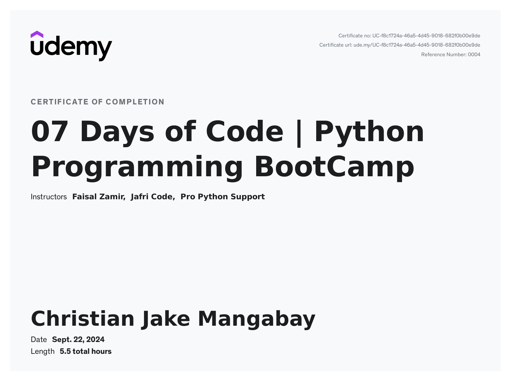

# 7Days_Training_Udemy
These are the practices I made along completing the course.

After months of taking a break, I finally continued and gained my certificate from Udemy [Course](https://www.udemy.com/course/learn-python-in-7-days-with-exercises-and-assignments) titled "07 Days of Code | Python Programming BoothCamp"

